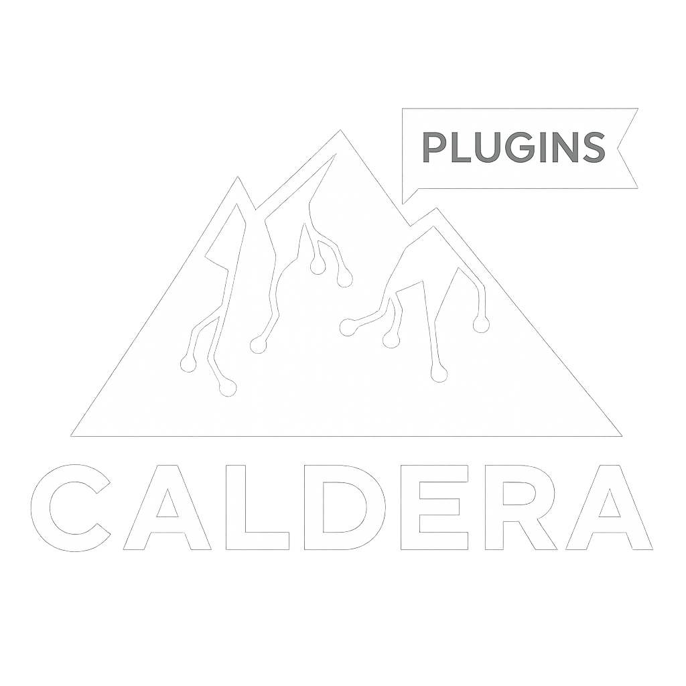

# Crater - MITRE Caldera™ plugins pack 

  

<b>Disclaimer:</b> Caldera is open project and my plugins are existing on contribution rights. I do not reserve any rights to the plugins, and anyone can modify and deploy them for their own instance.

## Configurations

MITRE Caldera works different in user specific environment, usually it is necessary to change default configuration or modify the source code. Visit the <a href=/caldera-configs/>caldera-configs</a> directory to get customization scripts and helpful platform configurations. 

## Plugins list
### Released
### Alpha stage
<ul><li><b>de(t)meter</b> - Detection Meter. Plugin that allows you to compare detection of your SIEM agent with Caldera's blue agent. It allows for real-time visualization of operation results. </li></ul>
<ul><li><b>dlp</b> - Add DLP adversaries to your MITRE Caldera.</li></ul>
<ul><li><b>peek</b> - View SIEM or different HTTP(S) security application directly from Caldera.</li></ul>

<b>Important:</b> All of the plugins listed above are in alpha stage, they might not work properly - I am actively trying to maintaing all of the projects and plugins.  

## Compatibility 
Plugins are currently in alpha stage, dedicated for Caldera in version 5.3.0. 
